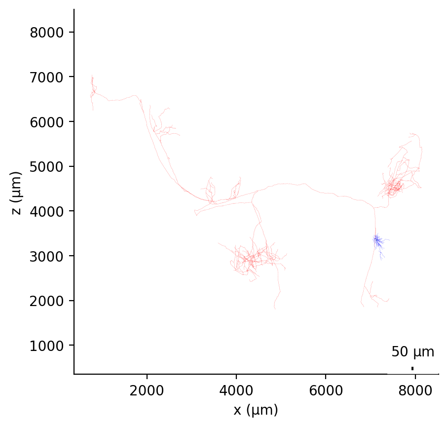
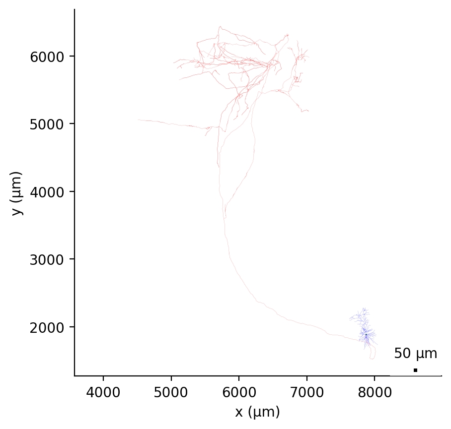
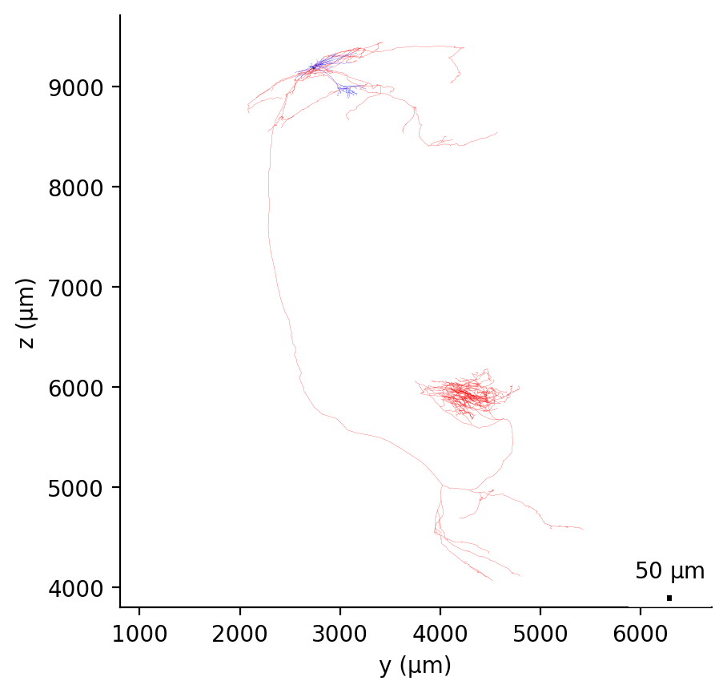
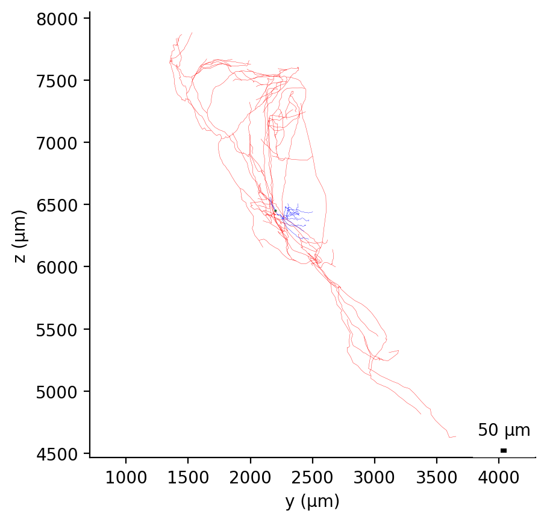

## MouseLight Showcase cells in NeuroML2 format

A number of the cellular reconstructions from the [Janelia MouseLight project](https://www.janelia.org/project-team/mouselight)
 have been converted to [NeuroML](http://www.neuroml.org) format and can be visualised on OSB.

The original data were made available by the [Janelia MouseLight project](https://www.janelia.org/project-team/mouselight)
under the CC-BY NC license, https://creativecommons.org/licenses/by-nc/4.0/legalcode.

The script to perform the transformation of the downloaded JSON files is
[export.py](https://github.com/OpenSourceBrain/MouseLightShowcase/blob/master/JSON/export.py) and uses [libNeuroML](https://github.com/NeuralEnsemble/libNeuroML).

To use this script:
```
pip install libNeuroML
git clone https://github.com/OpenSourceBrain/MouseLightShowcase.git
cd MouseLightShowcase/JSON
python export.py
```

**NOTE: cells have been given a spherical soma for visualisation purposes. However,
no soma has been reconstructed from the original cells.**

The cells which have been converted so far include:


## AA0289
<p>   </p>
Cell with 2886 segments (soma: 1 dend: 792, axon 2093)

https://doi.org/10.25378/janelia.5527822 - <a href="AA0289.cell.nml">NeuroML file</a>

## AA0274
<p>   </p>
Cell with 14391 segments (soma: 1 dend: 799, axon 13591)

https://doi.org/10.25378/janelia.5527774 - <a href="AA0274.cell.nml">NeuroML file</a>

## AA0267
<p>   </p>
Cell with 38635 segments (soma: 1 dend: 389, axon 38245)

https://doi.org/10.25378/janelia.5527747 - <a href="AA0267.cell.nml">NeuroML file</a>

## AA0261
<p>   </p>
Cell with 4960 segments (soma: 1 dend: 654, axon 4305)

https://doi.org/10.25378/janelia.5527717 - <a href="AA0261.cell.nml">NeuroML file</a>

## AA0250
<p>   </p>
Cell with 5305 segments (soma: 1 dend: 655, axon 4649)

https://doi.org/10.25378/janelia.5527678 - <a href="AA0250.cell.nml">NeuroML file</a>

## AA0188
<p>   </p>
Cell with 2118 segments (soma: 1 dend: 242, axon 1875)

https://doi.org/10.25378/janelia.5527468 - <a href="AA0188.cell.nml">NeuroML file</a>

## AA0182
<p>   </p>
Cell with 2932 segments (soma: 1 dend: 339, axon 2592)

https://doi.org/10.25378/janelia.5527447 - <a href="AA0182.cell.nml">NeuroML file</a>

## AA0180
<p>   </p>
Cell with 3849 segments (soma: 1 dend: 533, axon 3315)

https://doi.org/10.25378/janelia.5527441 - <a href="AA0180.cell.nml">NeuroML file</a>

## AA0052
<p>   </p>
Cell with 4086 segments (soma: 1 dend: 808, axon 3277)

https://doi.org/10.25378/janelia.5521753 - <a href="AA0052.cell.nml">NeuroML file</a>

## AA0257
<p>   </p>
Cell with 5108 segments (soma: 1 dend: 468, axon 4639)

https://doi.org/10.25378/janelia.5527702 - <a href="AA0257.cell.nml">NeuroML file</a>

## AA0252
<p>   </p>
Cell with 4694 segments (soma: 1 dend: 418, axon 4275)

https://doi.org/10.25378/janelia.5527684 - <a href="AA0252.cell.nml">NeuroML file</a>

## AA0248
<p>   </p>
Cell with 4316 segments (soma: 1 dend: 448, axon 3867)

https://doi.org/10.25378/janelia.5527672 - <a href="AA0248.cell.nml">NeuroML file</a>

## AA0173
<p>   </p>
Cell with 850 segments (soma: 1 dend: 273, axon 576)

https://doi.org/10.25378/janelia.5527420 - <a href="AA0173.cell.nml">NeuroML file</a>

## AA0171
<p>   </p>
Cell with 998 segments (soma: 1 dend: 210, axon 787)

https://doi.org/10.25378/janelia.5527414 - <a href="AA0171.cell.nml">NeuroML file</a>

## AA0158
<p>   </p>
Cell with 1042 segments (soma: 1 dend: 287, axon 754)

https://doi.org/10.25378/janelia.5527369 - <a href="AA0158.cell.nml">NeuroML file</a>

## AA0157
<p>   </p>
Cell with 1365 segments (soma: 1 dend: 298, axon 1066)

https://doi.org/10.25378/janelia.5527366 - <a href="AA0157.cell.nml">NeuroML file</a>

## AA1506
<p>   </p>
Cell with 3275 segments (soma: 1 dend: 1296, axon 1978)

No DOI - <a href="AA1506.cell.nml">NeuroML file</a>

## AA1507
<p>   </p>
Cell with 1915 segments (soma: 1 dend: 298, axon 1616)

No DOI - <a href="AA1507.cell.nml">NeuroML file</a>