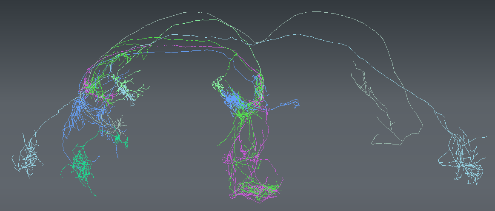

# MouseLight Showcase

Showcase project on OSB for neuronal reconstructions from the 
[Janelia MouseLight project](https://www.janelia.org/project-team/mouselight).

A number of these cellular reconstructions have been converted to [NeuroML](http://www.neuroml.org) 
format (see [here](/NeuroML2)) and can be visualised on OSB. 

The original data were made available by the [Janelia MouseLight project](https://www.janelia.org/project-team/mouselight) 
under the CC-BY NC license, https://creativecommons.org/licenses/by-nc/4.0/legalcode. 

